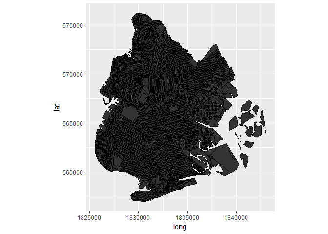
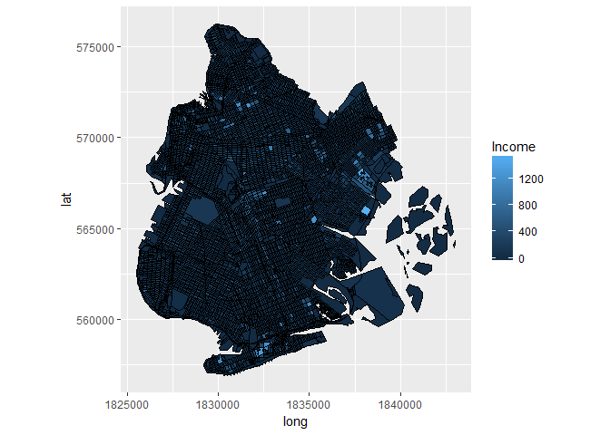
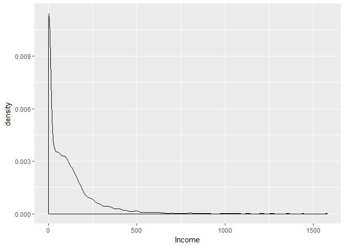
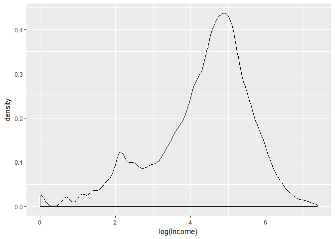
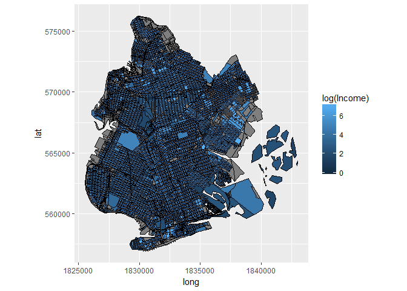
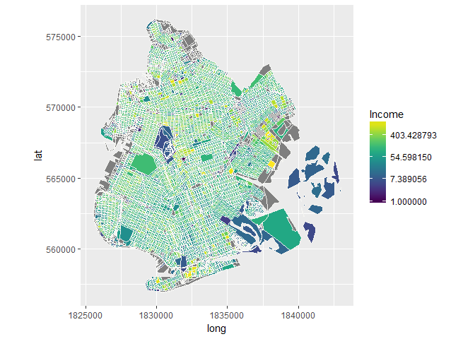
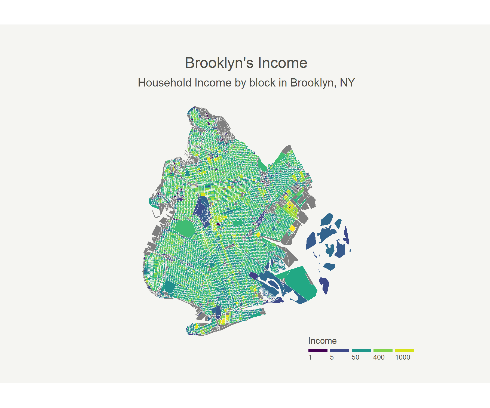

Income - Brooklyn, NY
================

Introduction
------------

Welcome! In this markdown document we'll be outlining the process of plotting some geospatial data. We're going to be plotting the household income for Brooklyn, NY for the year 2014. Let's get started.

Packages
--------

We are using the spc and rgdal packages for the reading of the data and the initial work. We then use tidyr and dplyr to do some manipulation later down the line, and finally we'll make use of the ggplot2 and viridis packages to make the plot.

``` r
library(sp)
library(rgdal)
```

    FALSE rgdal: version: 1.3-2, (SVN revision 755)
    FALSE  Geospatial Data Abstraction Library extensions to R successfully loaded
    FALSE  Loaded GDAL runtime: GDAL 2.2.3, released 2017/11/20
    FALSE  Path to GDAL shared files: C:/Users/Roland/Documents/R/win-library/3.5/rgdal/gdal
    FALSE  GDAL binary built with GEOS: TRUE 
    FALSE  Loaded PROJ.4 runtime: Rel. 4.9.3, 15 August 2016, [PJ_VERSION: 493]
    FALSE  Path to PROJ.4 shared files: C:/Users/Roland/Documents/R/win-library/3.5/rgdal/proj
    FALSE  Linking to sp version: 1.3-1

``` r
library(ggplot2)
library(tidyr)
library(dplyr)
```

    FALSE 
    FALSE Attaching package: 'dplyr'

    FALSE The following objects are masked from 'package:stats':
    FALSE 
    FALSE     filter, lag

    FALSE The following objects are masked from 'package:base':
    FALSE 
    FALSE     intersect, setdiff, setequal, union

``` r
library(viridis)
```

    FALSE Loading required package: viridisLite

Read SHP Data
-------------

First things first, reading the data. We read the .shp file by using the readOGR function from the rgdal package.

``` r
nyc <- readOGR(dsn = ".",
               layer = "NYC Area2010_2data")
```

    FALSE OGR data source with driver: ESRI Shapefile 
    FALSE Source: "C:\Users\Roland\Documents\git_repositories\GeoSpatial", layer: "NYC Area2010_2data"
    FALSE with 108487 features
    FALSE It has 70 fields
    FALSE Integer64 fields read as strings:  COUNTYFP10 ALAND10 AWATER10 C000_02 CE01_02 CE02_02 CE03_02 C000_03 CE01_03 CE02_03 CE03_03 C000_04 CE01_04 CE02_04 CE03_04 C000_05 CE01_05 CE02_05 CE03_05 C000_06 CE01_06 CE02_06 CE03_06 C000_07 CE01_07 CE02_07 CE03_07 C000_08 CE01_08 CE02_08 CE03_08 C000_09 CE01_09 CE02_09 CE03_09 C000_10 CE01_10 CE02_10 CE03_10 C000_11 CE01_11 CE02_11 CE03_11 C000_12 CE01_12 CE02_12 CE03_12 C000_13 CE01_13 CE02_13 CE03_13 C000_14 CE01_14 CE02_14 CE03_14

Trim Data Set
-------------

The data we loaded contains spatial data for all of New York. This data file is much too big for my laptop to handle! We use the 'COUNTYFP10' variable to filter for just Brooklyn, NY. Brooklyn is mapped to county code 47 in the data.

``` r
brooklyn <- nyc[nyc@data$COUNTYFP10 == "47",]
```

Fortify Data
------------

``` r
brooklyn.fortified <- fortify(brooklyn,
                              region = "GEOID10")
```

Fortifying our data puts it into a format that ggplot2 will understand. Note that we specify the region as the unique geo identifier 'GEOID10'. We can now take a look at our data:

``` r
str(brooklyn.fortified)
```

    FALSE 'data.frame': 61139 obs. of  7 variables:
    FALSE  $ long : num  1827609 1827672 1827669 1827633 1827549 ...
    FALSE  $ lat  : num  571441 571412 571377 571381 571397 ...
    FALSE  $ order: int  1 2 3 4 5 6 7 8 9 10 ...
    FALSE  $ hole : logi  FALSE FALSE FALSE FALSE FALSE FALSE ...
    FALSE  $ piece: Factor w/ 6 levels "1","2","3","4",..: 1 1 1 1 1 1 1 1 1 1 ...
    FALSE  $ id   : chr  "360470001001000" "360470001001000" "360470001001000" "360470001001000" ...
    FALSE  $ group: Factor w/ 9676 levels "360470001001000.1",..: 1 1 1 1 1 1 1 2 2 2 ...

Join on Income Data
-------------------

Note that we've lost the income data. Not a problem, we'll get that back using the following:

``` r
income.data <- data.frame("id" = as.character(brooklyn@data$GEOID10),
                          "Income_2014" = as.numeric(as.character(brooklyn@data$C000_14)))
```

Note that the original data file contains income for years 2002-2014. We will only look at the income for 2014 here, but an analysis of how the distribution of income has changed throughout the years could be an interesting next step!

Now we simply join this on to our fortified data using the unique 'GEOID10' column.

We also gather the data here and clean up the 'Year' column. This would be really helpful if we were analysing the income for multiple different years, as we could easily facet our plot by the 'Year' column.

``` r
brooklyn.fortified <- brooklyn.fortified %>%
  merge(income.data,
        by = "id") %>%
  gather(key = Year, value = Income, -id, -long, -lat, -order, -hole, -piece, -group)

brooklyn.fortified$Year[brooklyn.fortified$Year == "Income_2014"] <- "2014"
```

First try at a plot
-------------------

Now we can use ggplot to visualise the data and see what we've got. For starters, we'll just plot the polygons and worry about the household income in a minute.

``` r
ggplot() + 
  geom_polygon(data = brooklyn.fortified,
               aes(x = long, y = lat, group = group),
               col = "black",
               size = 0.1) +
  coord_equal()
```



Brilliant, we can see a clear map of Brooklyn, NY.

Adding Fill by Income
---------------------

It's time to add the income variable by using the fill aesthetic.

``` r
ggplot() + 
  geom_polygon(data = brooklyn.fortified,
               aes(x = long, y = lat, group = group, fill = Income),
               col = "black",
               size = 0.1) +
  coord_equal()
```



Good, we can see some of the blocks are standing out from the crowd. However, the majority of the blocks are all near enough one shade of dark blue and it's difficult to see any real distribution of income. Fear not, we should be able to correct this.

Distribution of Income
----------------------

Let's take a look at how Income is ditributed:

``` r
ggplot(brooklyn.fortified,
       aes(x = Income)) +
  geom_density()
```



That explains it. This heavily skewed distribution does not lend itself well to continuous colour scales. To fix this we can apply a log transformation, the result is a more bell-shaped curve that will work much better for our colour scale.

``` r
ggplot(brooklyn.fortified,
       aes(x = log(Income))) +
  geom_density()
```



Plot with Log Transformation
----------------------------

Now let's try replotting our data with this log transformation.

``` r
ggplot() + 
  geom_polygon(data = brooklyn.fortified,
               aes(x = long, y = lat, group = group, fill = log(Income)),
               col = "black",
               size = 0.1) +
  coord_equal()
```



It's better I suppose, isn't it? Well maybe, but it's a far reach from a "visually appealing plot" so we've still got to do something. The issue stems from the monochromatic scale we are using. Since everything is a different shade of a single colour, the lowest and highest income blocks can only look so different, in the end they will both still be blue. We can use a palette that uses more than one colour to help deal with this problem and make the differences in income really stand out.

Using the viridis palette.
--------------------------

The viridis palette gives us just the variety in colours we need. We'll plot again using this palette from the viridis package. Note that we take the log transform out of the geom\_polygon call and add it to the scale\_fill\_viridis call. We wil also change the line colour between blocks. Don't worry that the lines look a little obtrusive, this will be sorted when we create a higher quality image in the next step.

``` r
ggplot() + 
    geom_polygon(data = brooklyn.fortified,
                 aes(x = long, y = lat, group = group, fill = Income),
                 col = "#f5f5f2",
                 size = 0.001) +
    coord_equal() +
    scale_fill_viridis(trans = "log")
```



Much better.

Final Plot
----------

Now that we are happy with the way the data is displayed, we can add the finishing touches to the plot. We use a custom theme and modify the axis, title, legend etc. Firstly create the custom theme:

``` r
theme_map <- function(...) {
  theme_minimal() +
    theme(
      axis.line = element_blank(),
      axis.text.x = element_blank(),
      axis.text.y = element_blank(),
      axis.ticks = element_blank(),
      axis.title.x = element_blank(),
      axis.title.y = element_blank(),
      panel.grid.major = element_blank(),
      panel.grid.minor = element_blank(), 
      plot.background = element_rect(fill = "#f5f5f2", color = NA), 
      panel.background = element_rect(fill = "#f5f5f2", color = NA), 
      legend.background = element_rect(fill = "#f5f5f2", color = NA),
      panel.border = element_blank(),
      legend.position = c(1,0),
      legend.title = element_text("Income", color = "#4e4d47", size = 8),
      legend.text = element_text(color = "#4e4d47", size = 6)
    )
}
```

... and now plot:

``` r
ggplot() + 
  geom_polygon(data = brooklyn.fortified,
               aes(x = long, y = lat, group = group, fill = Income),
               col = "#f5f5f2",
               size = 0.001) +
  coord_equal() +
  theme_map() +
  scale_fill_viridis(trans =  "log", breaks=c(1,5,50,400,1000), name="Income", 
                     guide = guide_legend(keyheight = unit(1, units = "mm"), 
                                          keywidth=unit(6, units = "mm"), 
                                          label.position = "bottom", 
                                          title.position = 'top', 
                                          nrow=1)) +
  ggtitle("Brooklyn's Income",
          subtitle = "Household Income by block in Brooklyn, NY")+
   theme(plot.margin = unit(c(1,4,1,4), units = "cm"),
         plot.title = element_text(color = "#4e4d47", hjust = 0.5),
         plot.subtitle = element_text(color = "#4e4d47", hjust = 0.5))
```


